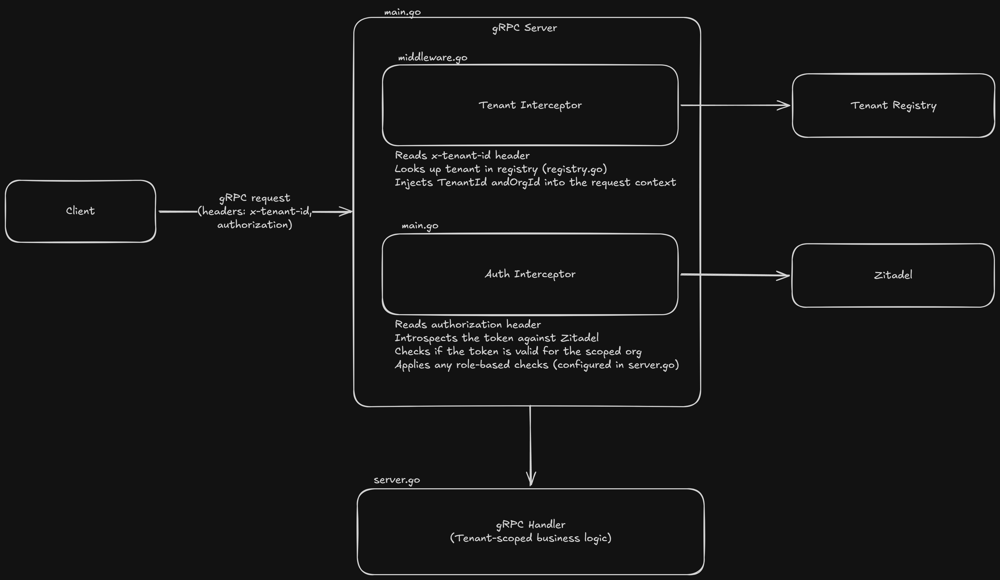

# User Service

A multi-tenant gRPC authentication and authorization service built with Go and [Zitadel](https://zitadel.com). Each tenant maps to a dedicated Zitadel organization, providing strong isolation of identities, roles, and data at the auth layer.

---

## Table of contents

- [Architecture overview](#architecture-overview)
- [Project structure](#project-structure)
- [How multi-tenancy works](#how-multi-tenancy-works)
- [Prerequisites](#prerequisites)
- [Zitadel setup](#zitadel-setup)
- [Configuration](#configuration)
- [Running the server](#running-the-server)
- [API reference](#api-reference)
- [Authorization model](#authorization-model)
- [Interceptor chain](#interceptor-chain)
- [Adding a new tenant](#adding-a-new-tenant)
- [Making authenticated requests](#making-authenticated-requests)
- [Development](#development)

---

## Architecture overview


```
Client
  │  gRPC + metadata: x-tenant-id, Authorization: Bearer <token>
  ▼
Tenant middleware          — resolves tenant ID → Zitadel org ID
  │
Auth middleware            — introspects token scoped to the resolved org
  │
Handler                    — business logic, data scoped by org ID
  │
Tenant registry            — in-memory map: tenantID → zitadel orgID
  │
Zitadel (one org/tenant)  — token introspection, role grants
```

The server chains two gRPC interceptors on every request. The tenant interceptor runs first: it reads the `x-tenant-id` metadata header, resolves it to a Zitadel org ID via the registry, and injects both values into the request context. The Zitadel auth middleware then introspects the bearer token within that org's scope, so a token issued by one tenant cannot be used to access another.

---

## Project structure

```
.
├── cmd/
│   └── main.go                        # Server entry point, interceptor wiring
├── internal/
│   ├── handlers/
│   │   ├── server.go                  # gRPC handler implementations
│   │   └── proto/
│   │       ├── api.proto              # Service and message definitions
│   │       ├── api_grpc.pb.go         # Generated gRPC stubs
│   │       ├── api.pb.go              # Generated protobuf types
│   │       └── buf.gen.yaml           # buf code generation config
│   ├── tenant/
│   │   ├── registry.go                # tenantID → orgID lookup
│   │   └── middleware.go              # gRPC interceptors for tenant extraction
│   └── services/
│       └── zitadel/
│           ├── client.go              # Zitadel management API client
│           └── org.go                 # Org-scoped client interceptor
└── go.mod
```

---

## How multi-tenancy works

This service uses **one Zitadel organization per tenant**.

Each tenant (`acme-corp`, `globex`, etc.) is provisioned as a separate organization in your Zitadel instance. Users, roles, and applications are scoped to their organization. When a request arrives:

1. The client sends `x-tenant-id: acme-corp` in gRPC metadata alongside a bearer token.
2. The tenant middleware looks up `acme-corp` in the registry and resolves it to the Zitadel org ID (e.g. `org_abc123`).
3. The Zitadel auth middleware introspects the token. Because introspection is scoped to `org_abc123`, a token from `globex`'s org is rejected even if it is otherwise valid.
4. Handlers read the org ID from context and use it to scope all data reads and writes, so tenant data never leaks across org boundaries.

---

## Prerequisites

- Go 1.22+
- A running Zitadel instance (Cloud or self-hosted)
- [buf](https://buf.build/docs/installation) for protobuf code generation
- A Zitadel API service account key file (`key.json`)

---

## Zitadel setup

### 1. Create one organization per tenant

In your Zitadel console, create a separate organization for each tenant. Note the **org ID** from the organization's detail page — you will need it for the tenant registry.

### 2. Create an API application

Within each tenant's organization, create an application of type **API** with the **Private Key JWT** authentication method. Download the generated `key.json` file and store it securely.

### 3. Grant roles

Define the roles your service uses (e.g. `admin`) at the project level in Zitadel, then grant them to users within each org. Role grants are org-scoped, so an `admin` grant in `acme-corp`'s org does not apply in `globex`'s org.

### 4. Configure the tenant registry

Add each tenant's ID and its corresponding Zitadel org ID to the registry in `cmd/main.go`:

```go
registry := tenant.NewRegistry(map[string]string{
    "acme-corp": "org_abc123",
    "globex":    "org_def456",
})
```

In production, replace the in-memory map with a database-backed implementation (see [Adding a new tenant](#adding-a-new-tenant)).

---

## Configuration

The server accepts the following command-line flags:

| Flag       | Required | Description                                                                 |
|------------|----------|-----------------------------------------------------------------------------|
| `-domain`  | Yes      | Your Zitadel instance domain, e.g. `myinstance.zitadel.cloud`               |
| `-key`     | Yes      | Path to your API service account `key.json`                                 |
| `-port`    | No       | Port to listen on (default: `8089`)                                         |

---

## Running the server

```bash
go run ./cmd/main.go \
  -domain myinstance.zitadel.cloud \
  -key /path/to/key.json \
  -port 8089
```

The server registers gRPC reflection, so you can explore the API with tools like [grpcurl](https://github.com/fullstorydev/grpcurl) or [Postman](https://www.postman.com).

---

## API reference

### `Healthz`

```
rpc Healthz(HealthzRequest) returns (HealthzResponse)
```

Public endpoint. No authentication required. Returns `{ "health": "OK" }` when the server is running.

---

### `ListTasks`

```
rpc ListTasks(ListTasksRequest) returns (ListTasksResponse)
```

Requires a valid bearer token. Returns the list of tasks stored for the caller's tenant. If the caller holds the `admin` role, an additional prompt to create a task is appended to the list.

---

### `AddTask`

```
rpc AddTask(AddTaskRequest) returns (AddTaskResponse)
```

Requires a valid bearer token **and** the `admin` role. Adds a single task to the caller's tenant task list. Returns an error if `task` is empty.

**Request fields:**

| Field  | Type   | Description              |
|--------|--------|--------------------------|
| `task` | string | The task text to add     |

---

### `AddTasks`

```
rpc AddTasks(stream AddTasksRequest) returns (AddTasksResponse)
```

Requires a valid bearer token **and** the `admin` role. Client-streaming RPC. Accepts a stream of task messages and returns the total count of tasks added. Returns an error if no tasks were sent or if the stream is closed without any valid task.

---

## Authorization model

Authorization checks are declared in `internal/handlers/server.go` as a map from gRPC full method names to a list of `CheckOption` values:

```go
Checks = map[string][]authorization.CheckOption{
    proto.AuthService_Healthz_FullMethodName:   nil,             // public
    proto.AuthService_ListTasks_FullMethodName: nil,             // any valid token
    proto.AuthService_AddTask_FullMethodName:   {authorization.WithRole("admin")},
    proto.AuthService_AddTasks_FullMethodName:  {authorization.WithRole("admin")},
}
```

Any endpoint **not present in this map** is publicly accessible with no token check. Endpoints present with `nil` checks require only a valid token. Endpoints with `WithRole(...)` checks require the token's user to hold that role within their organization.

---

## Interceptor chain

The server chains two interceptors, applied in order on every call:

```
Request
  │
  ▼
1. Tenant interceptor (internal/tenant/middleware.go)
   - Reads x-tenant-id from incoming gRPC metadata
   - Looks up org ID in the tenant registry
   - Injects tenantID and orgID into context
   - Returns codes.InvalidArgument if header is missing
   - Returns codes.NotFound if tenant is unknown
  │
  ▼
2. Zitadel auth interceptor (zitadel-go SDK middleware)
   - Reads Authorization: Bearer <token> from metadata
   - Introspects token against Zitadel, scoped to the org from step 1
   - Runs any CheckOption role assertions for the method
   - Returns codes.Unauthenticated or codes.PermissionDenied on failure
  │
  ▼
Handler
```

The `tenant.OrgIDFromCtx(ctx)` and `tenant.TenantIDFromCtx(ctx)` helpers are available inside any handler to retrieve the resolved values.

---

## Adding a new tenant

### Development (in-memory registry)

Add the tenant to the map in `cmd/main.go`:

```go
registry := tenant.NewRegistry(map[string]string{
    "acme-corp":  "org_abc123",
    "globex":     "org_def456",
    "new-tenant": "org_ghi789", // add this line
})
```

### Production (database-backed registry)

Replace the in-memory `Registry` with a persistent implementation by satisfying the same interface. A minimal Postgres-backed example:

```go
type DBRegistry struct {
    db *sql.DB
}

func (r *DBRegistry) OrgID(ctx context.Context, tenantID string) (string, error) {
    var orgID string
    err := r.db.QueryRowContext(ctx,
        `SELECT zitadel_org_id FROM tenants WHERE tenant_id = $1`, tenantID,
    ).Scan(&orgID)
    if errors.Is(err, sql.ErrNoRows) {
        return "", fmt.Errorf("unknown tenant: %s", tenantID)
    }
    return orgID, err
}
```

You will also need to:

1. Create the organization in Zitadel (via the management API or console).
2. Insert the tenant row into your database.
3. Provision any default roles and users for the new org.

The Zitadel management client in `internal/services/zitadel/client.go` can be used to automate org provisioning. Use the `OrgInterceptor` in `internal/services/zitadel/org.go` to scope management API calls to a specific organization.

---

## Making authenticated requests

All requests except `Healthz` require two metadata headers:

| Header          | Value                              |
|-----------------|------------------------------------|
| `x-tenant-id`   | Your tenant identifier, e.g. `acme-corp` |
| `authorization` | `Bearer <access_token_or_PAT>`     |

### Example with grpcurl

```bash
# Health check (no auth)
grpcurl -plaintext localhost:8089 cloudproject.auth.v1.AuthService/Healthz

# List tasks (valid token required)
grpcurl -plaintext \
  -H "x-tenant-id: acme-corp" \
  -H "authorization: Bearer <your_token>" \
  localhost:8089 cloudproject.auth.v1.AuthService/ListTasks

# Add a task (admin role required)
grpcurl -plaintext \
  -H "x-tenant-id: acme-corp" \
  -H "authorization: Bearer <your_admin_token>" \
  -d '{"task": "deploy to production"}' \
  localhost:8089 cloudproject.auth.v1.AuthService/AddTask
```

Tokens can be Zitadel Personal Access Tokens (PATs) or short-lived access tokens obtained via any OAuth2 flow configured on your Zitadel application.

---

## Development

### Regenerate protobuf code

```bash
cd internal/handlers/proto
buf generate
```

### Run tests

```bash
go test ./...
```

### Lint

```bash
go vet ./...
```

### Key dependencies

| Package | Purpose |
|---|---|
| `github.com/zitadel/zitadel-go/v3` | Authorization middleware and Zitadel management client |
| `github.com/zitadel/oidc/v3` | OIDC scopes for service account authentication |
| `google.golang.org/grpc` | gRPC server and interceptor framework |
| `google.golang.org/protobuf` | Protobuf runtime |